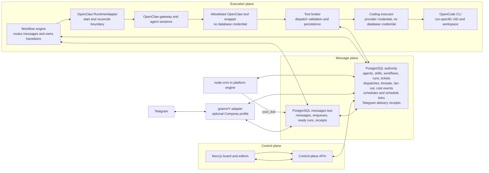

# OrbitFlow

OrbitFlow is a TypeScript application for defining agents and workflows, retaining
their execution trail in PostgreSQL, and connecting an OpenClaw agent runtime to
the workflow engine. Monitoring is the run-filtered ticket board.

Accepted Factory workspaces can be copied from the Compose volume with the
single operator command documented in
[`docs/factory-workspace-export.md`](docs/factory-workspace-export.md).

The default Compose stack runs the production PostgreSQL consumer, dispatcher,
scheduler, and OpenClaw runtime adapter. Its readiness endpoint becomes
operational only after both durable polling loops have reached PostgreSQL.

## Architecture



PostgreSQL is the authority for the durable control, message, and execution
records. The engine consumes a bus message and commits its routing receipt and
transition together. The runtime adapter owns the provider boundary; an agent
output does not select the next workflow node. Telegram inbound and outbound
work is represented in the same message trail, with provider-specific durable
receipts. The coding tool is an agent tool, not a second orchestrator. Its
broker holds database authority while the coding executor is isolated from the
database network.

## Start from a clean clone

Requirements: Docker Desktop, Docker Compose, and a value for the OpenRouter
credential. The repository targets Node.js 22 or newer for local non-Docker
commands.

```sh
git clone https://github.com/AdamRoch/OrbitFlow.git
cd OrbitFlow
cp .env.example .env
# Edit .env and set POSTGRES_PASSWORD and OPENROUTER_API_KEY.
docker compose up --build
```

The one Compose command starts PostgreSQL, a one-shot migrator, the board/API,
the production engine, the OpenClaw gateway, the tool broker, and the coding
executor. The app is published only on localhost at
`http://127.0.0.1:${ORBITFACTORY_APP_PORT}`. The Telegram adapter is opt-in.
After filling in the required variables below, its canonical demo command is:

```sh
docker compose --profile telegram up --build
```

Set `TELEGRAM_BOT_TOKEN` in `.env` before running that command. The default
`docker compose up --build` topology does not start a Telegram consumer. The
one-shot coding-adapter wrapper is also opt-in; its boundary is in [the Compose
runbook](docs/fact-7-docker-compose.md).

| Variable | Class | Used by | Notes |
| --- | --- | --- | --- |
| `POSTGRES_DB`, `POSTGRES_USER`, `POSTGRES_PASSWORD` | Required | Compose PostgreSQL, migrator, app, engine, tool broker | Set all three in `.env`; `POSTGRES_PASSWORD` must be a local secret. |
| `ORBITFACTORY_APP_PORT`, `ORBITFACTORY_ENGINE_HOST_PORT` | Required | Compose host port bindings | Select localhost ports for the app and readiness endpoint. |
| `OPENROUTER_API_KEY` | Provider credential, required by default Compose | OpenClaw gateway, coding executor; opt-in coding adapter | The only evaluator provider credential in the shipped Compose topology. It is not passed to the engine or tool broker. |
| `TELEGRAM_BOT_TOKEN` | Optional provider credential | `telegram` profile | Required only when enabling the grammY long-poll adapter. |
| `ORBITFACTORY_CODING_ADAPTER_BINARY` | Optional / proof override | `coding-adapter` profile | Defaults to `opencode`; the proof selects its committed fake binary with this setting. |
| `ORBITFLOW_WORKSPACE_ROOT`, `ORBITFLOW_RUNTIME_ROOT` | Compose-supplied | Engine, tool broker, coding executor | Internal mounted paths, not values to put in the normal `.env`. Dispatch attribution is persisted by the engine and verified by the broker. |
| `ORBITFLOW_OPENCODE_MODEL`, `ORBITFLOW_CODING_TIMEOUT_MS` | Optional runtime tuning | Tool broker, coding executor | Configuration of the pinned coding CLI boundary. |
| `ORBITFLOW_OPENCODE_BINARY`, `ORBITFLOW_ENABLE_REAL_OPENCODE_PROOF`, `ORBITFLOW_ENABLE_REAL_OPENCLAW_CODING_PROOF`, `ORBITFLOW_FACT11_REAL_PROVIDER_PROOF` | Proof-only | Targeted proof harnesses | Not part of normal startup; the real-provider gates require credentials and can spend provider credit. |

## Why this runtime and stack

### OpenClaw is the runtime boundary; OpenCode is a tool

OpenClaw is the selected agent-session runtime because the implemented
`OpenClawRuntimeAdapter` can synchronize agent state, start or reconcile a
durable invocation, validate its structured output, and keep an ambiguous
provider start from being replayed blindly. The workflow engine stays in charge
of state transitions and durable dispatches.

OpenCode is deliberately lower in the stack. OpenClaw receives only a narrow,
allowlisted wrapper. The tool broker verifies the active dispatch and owns
workspace and cost persistence, then sends coding work to a database-isolated
executor. Each delegation runs under a permanently reserved run-specific UID.
The coding boundary does not decide which agent runs next, own workflow state,
or replace the engine. The v1 CLI selection and its constraints are recorded in
[the coding-adapter decision](coding-adapter/DECISION.md).

Goose is not a shipped runtime or tool in this repository. No code or retained
proof here establishes an operational comparison with it, so the reason for not
using Goose is simply that OrbitFlow has no Goose adapter or integration to
operate. This is a design boundary, not a claim that one CLI is universally
better than another.

The dispatch and handoff-brief vocabulary has Firstmate lineage. That credits
the workflow pattern that informed this project; it does not claim that
Firstmate owns the OrbitFlow implementation. The tracked files and commits in
this repository are the evidence for the code that is actually present.

### TypeScript, Next.js, PostgreSQL, and Compose

TypeScript keeps the Next.js UI/API, workflow graph validation, engine seams,
and adapter contracts in one typed codebase. Next.js supplies the retained
board and editor surfaces. PostgreSQL is used where atomic workflow transitions,
durable messages, receipts, leases, and cost records matter. Compose makes the
local PostgreSQL, app, engine, gateway, broker, executor, and profile boundaries
repeatable without requiring host-installed database or gateway state.
PostgreSQL is also the only ticket authority. The root route redirects to the
run-filtered Monitoring Board, and agents write through platform tools.

## Extend safely

### Add a workflow template

Start with the immutable graph contract in
[`src/lib/workflow/graph-contract.ts`](src/lib/workflow/graph-contract.ts) and
the durable engine behavior in [the workflow-engine document](docs/workflow-engine.md).
Add a forward PostgreSQL migration after the current chain, using
[`0013-workflow-templates.sql`](db/migrations/0013-workflow-templates.sql) as
the seed and idempotency reference. Extend
[`test/postgres/workflow-templates.test.mjs`](test/postgres/workflow-templates.test.mjs)
for clean installation, restart, and existing-user-data behavior, then run
`npm run fact21:proof` when Docker is available.

### Add a messaging channel

Keep provider effects behind an adapter and make the universal `messages` row
the conversation trail. The Telegram implementation is the reference:
[the adapter](src/lib/telegram/adapter.ts),
[its migration](db/migrations/0016-telegram-channel.sql), and
[its proof](test/postgres/telegram.test.mjs). Its contracts, including the
fail-closed handling of an ambiguous outbound send, are documented in
[`docs/telegram-adapter.md`](docs/telegram-adapter.md). A new channel needs its
own durable deduplication/delivery state and proof; it should not bypass the
workflow engine or write directly to a provider from an agent.

## OrbitTrack foundation, adapted and stripped

OrbitFlow adapted its ticket foundation from OrbitTrack commit
[`589e04165a0744be10b7fc1b05984c6a3bff234c`](https://github.com/AdamRoch/OrbitTrack/commit/589e04165a0744be10b7fc1b05984c6a3bff234c),
retaining the run-filtered board, ticket workflow, and blocker concepts. OrbitFlow's
PostgreSQL database is the runtime ticket authority; OrbitTrack remains the
external development work tracker. OrbitFlow-specific work added the PostgreSQL
contracts, bus, engine, runtime/tool boundaries, templates, Telegram adapter,
guardrails, and scheduling.

The P1-1 strip removed the inherited dependency map, OrbitTrack Q&A,
multi-project management, bundled tracker skills/upstream planning documents,
and unused starter assets. This is an adaptation rather than a claim that the
current UI is a finished OrbitFlow control surface. The exact keep/delete list
and provenance live in [the OrbitTrack inventory](docs/fact-5-orbittrack-inventory.md).

## Scheduling tradeoff

Scheduling runs in the platform engine with `node-cron`, not in OpenClaw. Each
tick becomes a durable `cron_tick` message and reaches the same engine path as
other work, giving operators one message trail and one routing model. The cost
is intentional coupling: schedule availability is currently bounded by the
single platform-engine scheduler rather than delegated to an OpenClaw scheduler.
OpenClaw scheduling remains disabled and unused. See
[the scheduling contract](docs/scheduling.md) and its proof for the exact
single-process boundary.

## Useful proof and reference points

- `npm test` runs the app, Phase 0, and coding-adapter suites without a provider call.
- `bash scripts/fact-7-compose-proof.sh` is the disposable clean-Compose gate.
- `npm run fact9:proof`, `npm run fact10:proof`, and `npm run fact11:proof` cover the bus, engine, and runtime adapter.
- `npm run fact42:postgres-proof` covers the PostgreSQL-only ticket and Monitoring data path.
- `npm run fact31:proof` covers production Compose readiness, migration freshness, and restart recovery without a provider call.
- `npm run fact34:proof` covers the deterministic Software Factory question, rejection, correction, approval, and local Telegram boundary.
- `npm run fact49:proof` covers planner dependency targets and bound-ticket target enforcement through the real OpenClaw wrapper, Unix-socket broker, and disposable Compose topology.
- `npm run fact15:proof`, `npm run fact21:proof`, `npm run fact23:proof`, and `npm run fact25:proof` cover Telegram, templates, guardrails, and scheduling.
- [PostgreSQL schema](docs/postgres-schema.md), [message bus](docs/message-bus.md), [workflow engine](docs/workflow-engine.md), and [OpenClaw adapter](docs/openclaw-runtime-adapter.md) are the authoritative detailed contracts.

Some proof commands start disposable PostgreSQL containers; use them only when
Docker is healthy. Real-provider proof gates are opt-in and may spend provider
credit.
