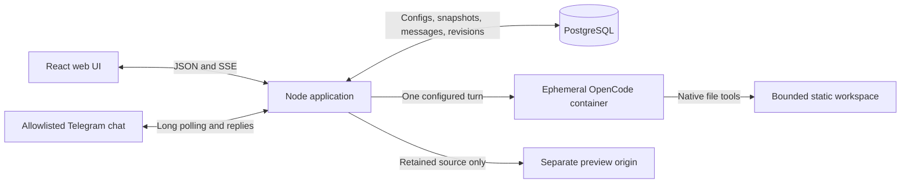

# OrbitFlow

OrbitFlow creates configurable agents and connects them through durable, editable workflows. Its build and improve templates use OpenCode's real file tools to produce small browser applications, retain their source, send review feedback, and present a separate-origin preview for human approval. Telegram supports conversation and workflow requests through a separately configured bot.

The local implementation and focused checks are complete. Real provider runs built an application through review and revision, then improved that same application from a Telegram request and approved it through Telegram. Native Chrome and Safari checks verified duplication and data retention across revisions and reloads. A real scheduled wake and a memory-based Telegram conversation also completed. Adam's walkthrough remains final product acceptance; this is a bounded local application, with the limits below.

Open the running studio at http://127.0.0.1:4310. See the [recorded demo](docs/demo/orbitflow-real-demo.mp4), [recording provenance](docs/demo/REAL-DEMO.md), and [manual walkthrough](docs/WALKTHROUGH.md). Exact run IDs and verification evidence are in docs/live-runtime-evidence.md.

The [OrbitFlow tutorial slideshow](docs/tutorial/orbitflow-tutorial.pptx) walks through the current cloud studio, a first build, human approval, Telegram improvements, and agent/workflow configuration. Speaker notes include commands and troubleshooting details.

## Run locally

Install Node.js 22.12 or newer and start Docker Desktop. From this directory, run `npm run setup`. It installs locked packages, starts this project's PostgreSQL container, builds the pinned runtime image and web UI, then starts OrbitFlow at http://127.0.0.1:4310. Each application lineage has its own `app-<id>.localhost` origin on port 4312, preserving its storage across improvements without mixing unrelated apps. Generated previews use port 4312 and the database uses 54329. Keep the command running. Ctrl-C stops this application's executor and active runtime turn; it leaves the database volume intact. `docker compose stop` stops only this project's database.

Without provider configuration, the UI, editing, history and source inspection work, but real agent turns fail with an explicit missing-budget or missing-credential message. Before real runs, copy `.env.example` to `.env`, enter the authorized provider credential and budget, then rerun setup. Select a valid provider/model ID in each agent. `ORBITFLOW_MODEL` seeds the default model; optional `ORBITFLOW_REVIEWER_MODEL` seeds Reviewer roles separately. These defaults apply only when templates are first created. Configuration changes apply to new runs; existing runs retain their agent and workflow snapshots, which remain visible with their history.

Before each turn, OrbitFlow checks recorded total and per-agent spending and passes the smaller remaining allowance into the runtime. The runtime watches cost reported by OpenCode and cancels further work when observed cost reaches that allowance. Provider reporting can lag an in-flight request, so this limit can still be exceeded; use a provider-side spending limit when a hard cap is required. Missing cost stays unknown rather than becoming zero and blocks later paid turns until it is reconciled. Interrupted historical work can also show incomplete usage with an explanation instead of invented token or cost totals.

Configure a **new** Telegram bot using `TELEGRAM_BOT_TOKEN` and your private chat's `TELEGRAM_CHAT_ID`. Do not reuse the original OrbitFlow bot. Restart the app and enable Telegram on exactly one agent. Plain messages reach that agent with its saved instructions, skills and memory. `/help` lists workflow commands. `/build <workflow ID> <request>` starts a workflow; `/improve` selects the latest approved application when exactly one loaded improvement workflow exists, then asks what to change. Reply with an ordinary sentence. `/improve <request>` does both in one message. The explicit `/improve <workflow ID> <approved run ID> <request>` form remains available when you need to choose a particular application. Telegram-created runs support `/approve <run ID> <approval token>`, `/reject <run ID> <approval token> <feedback>` and `/status <run ID>`. Other chats are ignored. Credentials remain server-side and never appear in the UI.

## Architecture

TypeScript keeps the UI, API and runtime contract in one language. PostgreSQL owns state transitions and asynchronous addressed messages. The executor commits the result, message, revision and next node together. Each run keeps the agents and graph it started with, so later configuration edits cannot rewrite its behavior or displayed history. It holds one database advisory lock for local execution ownership; this is a single-user local application, not a multi-tenant cloud service. Interrupted provider calls are not automatically replayed after a server restart. Inspect the run, reconcile any unknown cost with a provider receipt, then use Resume to continue at the retained node with its saved setup. Completed turns are not replayed.

OpenCode 1.18.29 fits the code-generation requirement through its headless API, real read/edit tools, structured outcomes, usage records and cancellation. OpenClaw's broader always-on topology and Goose's extension integration are unnecessary for this bounded local app. See docs/runtime-integration.md for primary sources and verified API details, and ADR/ for consequential decisions.

Runtime containers receive one scratch workspace and runtime configuration, run without host home, database credentials or Docker socket, and cannot execute generated shell/server code. Native tools are limited to the configured static-file operations. The generated application runs only in the browser on a separate local origin, with network requests and embedded frames disabled by CSP. It uses localStorage for persistence. Do not put private data into generated demos. This boundary deliberately excludes arbitrary backends, package installation, authentication, payments and public deployment.

## Extend

To add a workflow template, define its agents and graph in `src/server/seed.ts`. Nodes reference agent IDs and declare `terminalOutcomes`; edges match the runtime's structured `outcome`, with `*` as an otherwise route. Resolution checks an exact edge, an explicit terminal outcome, then a wildcard edge. Any other outcome fails with the allowed values while retaining the result and source revision for inspection. Users can load independent editable copies, modify route conditions, terminal outcomes and feedback loops. Agent turn limits bound loops. A human rejection records feedback and restarts at the entry node using the retained files.

To add a channel, implement a receiver alongside `src/server/integrations.ts`: authenticate the sender, persist a channel delivery ID, call `enqueue` with an idempotency key, and persist outgoing replies. The channel must not write workflow execution state directly. Telegram inbound processing is deduplicated, and one serialized outbox drain prevents the poller and run monitor from sending the same pending reply concurrently. A crash after Telegram accepts a reply but before its receipt is stored can still duplicate that reply because Telegram's send API has no idempotency key.

Agent schedules accept cron expressions or intervals such as `@every 15m`. A scheduled workflow must contain the agent whose schedule wakes it. Due times and pending dispatch IDs persist in PostgreSQL; the UI exposes the next wake, disabled schedules do not wake, and restart does not flood missed intervals. Scheduled request messages record `schedule:<agentId>` as their sender so the run's origin remains inspectable. Memory and reusable skill steps are included in new runtime turns. Blocked actions use native tool names and remove those tools from execution. Approval can pause every agent turn, require final artifact approval, or permit autonomous completion.

## Verification and walkthrough

`npm test` exercises configuration and graph routing, real PostgreSQL enqueue deduplication, snapshots, durable request messages, human approval and cancellation, plus clearly labeled integration transport tests. It retains named verification rows in the separate `orbitflow` verification database; the product uses `orbitflow_v2`. `npm run typecheck` checks the shared/server/UI contract; `npm run build` builds the web application. These are separate from a real model run and Adam's acceptance.

1. Run `npm run setup` and open the local UI. Load **Build an application**, inspect Builder and Reviewer settings and the feedback routes.
2. Request a workout tracker with routines, workout logging and weekly progress. Inspect actual tools and the addressed review conversation.
3. Inspect source and preview. Create a routine, log a workout, reload, and confirm data remains. Approve the exact revision.
4. Load **Improve an application**. In the configured Telegram chat, send `/improve`, then reply “Add a way to duplicate a routine.” Follow the real replies and approval.
5. Open the new preview, duplicate a routine, reload, and check persistence. Inspect source revisions, token/cost data and the retained conversation. Adam's walkthrough is final acceptance.

The [final recorded demo](docs/demo/orbitflow-real-demo.mp4) shows the live Telegram improvement, actual runtime work, retained application data, duplication, Telegram approval and a real memory response. Its starting application was produced earlier by the recorded four-turn build history; the video provenance distinguishes those events. Earlier development footage remains separately labeled as a draft. Local automated checks and agent source review are distinct from the native browser checks and Adam's acceptance.

The protected Railway deployment is live at https://orbitflow.adamroch.com. A real cloud build/review/revision/approval workflow and browser persistence checks passed; Adam's production walkthrough remains final acceptance. See [the production test runbook](docs/PRODUCTION.md) and [cloud deployment evidence](docs/cloud-deployment-evidence.md). Cloud runtime transport uses isolated per-turn Railway Sandboxes; local setup continues to use Docker directly. See [ADR 0002](ADR/0002-protected-railway-demo.md) for access, isolation, spending, and rollback decisions.

GitHub `main` is the release branch for the existing Railway studio service. The minimal CI workflow installs dependencies, typechecks, and builds; tests and browser verification stay local. Railway is configured to wait for this workflow before automatic deployments. See [ADR 0004](ADR/0004-github-deployment-source.md) for the source transition and verification boundary.
